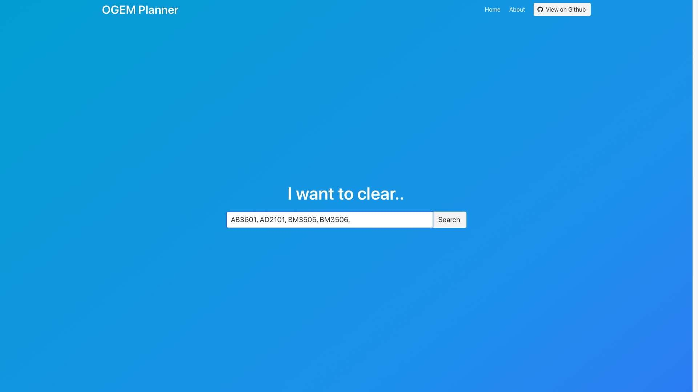
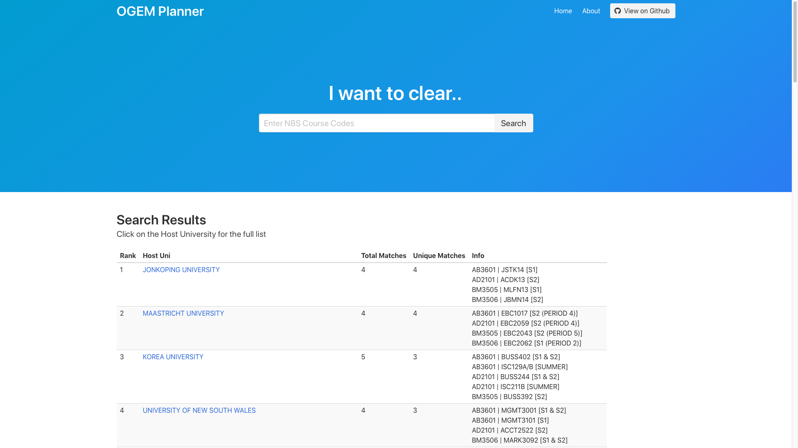
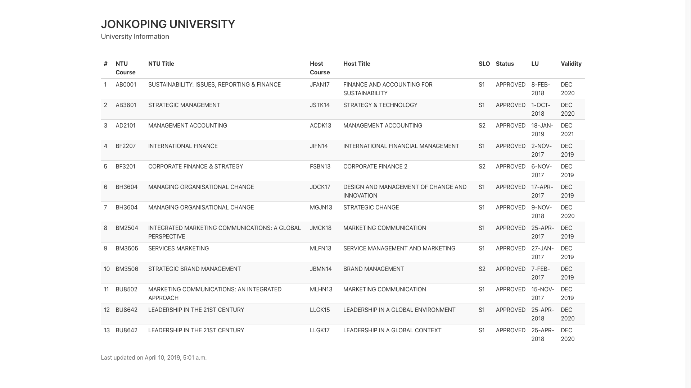

# OGEM Planner

*NOTE: This project is no longer maintained. Refer to the official [NBS Exchange Portal](http://web.nbs.ntu.edu.sg/undergrad/intranet/stdexchange/gem_explorer/Approve_Course.asp) for your course-matching needs.* 

OGEM Planner is a course-matching tool for NBS outbound exchange students. 

This project was created to help fellow NBS students find host universities that matches the modules they want to clear on exchange. It provides a key functionality that allows students to find the best matching university based on a basket of modules, a function that was originally lacking in school's website. Since then, the NBS Exchange Office took initiative to revamp their original course-matching site to include components of this project. 

## Feature Overview

#### Search multiple courses at once

#### Recommends the universities based on selected courses

#### Displays additional information about Host University

## License

This project is licensed under the GNU GPLv3 License.
